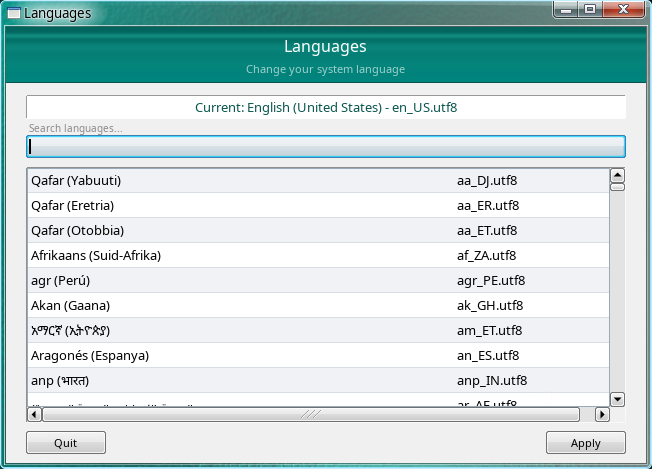
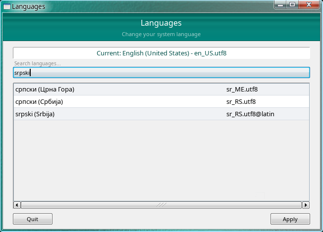
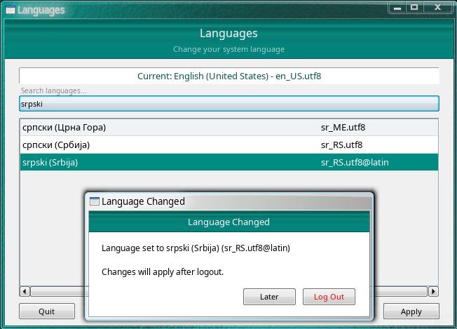

# xfce-aero-lang-changer

<table style="border-collapse: collapse; border: none; background: transparent; width: 100%;">
  <tr>
    <td style="border: none; padding: 0 4px; background: transparent; width: 33.33%;">
      
    </td>
    <td style="border: none; padding: 0 4px; background: transparent; width: 33.33%;">
      
    </td>
    <td style="border: none; padding: 0 4px; background: transparent; width: 33.33%;">
      
    </td>    
  </tr>
</table>

A language picker for Arch + XFCE X11 desktops, built with FLTK in Aero style.

Presents all generated system languages in a table with native names. Filter as you type with built-in Latin ↔ Cyrillic transliteration. Selecting a language writes it to `locale.conf` and offers to log out so the change takes effect on next login.

Made primarely for the purposes of my XFCE custom image distribution:  
https://github.com/fiftydinar/xfce-aerolike

```sh
make && sudo make install
```

## How it works

The tool writes `LANG=<language>` to `$XDG_CONFIG_HOME/locale.conf`. On Arch Linux and derivatives, this file is sourced by `/etc/profile.d/locale.sh` at login. It also injects the same `LANG` export into `~/.xprofile` for sessions that read that file.

The selected language is applied on the **next login**, not immediately. After picking a language, the dialog lets you either log out now or do it later.

## Compatibility guard

Before opening the picker, the app checks for known incompatibilities — Wayland sessions, non-Arch distros, GNOME/KDE/Deepin desktop environments, and similar scenarios where `locale.conf` may be ignored or overridden. If any are detected, the app displays the details and exits.

This guard exists because the tool writes to a file that only certain session stacks respect. Running it blindly on an incompatible setup gives the illusion of a working language change while actually doing nothing.

## Requirements

**Run-time:**
- Linux with XFCE (or another desktop that reads `locale.conf`/`.xprofile`)
- X11 session (Wayland is not supported by the compatibility guard)
- System languages generated (check with `locale -a`)
- Pango, Cairo and X11 client libraries (if not using AppImage builds)

**Build-time:**
- Rust toolchain (`cargo`)
- CMake (for bundled FLTK build)

## Installing

### Install - AppImage (generic)

I am showing the local installation steps below only, advanced users can install it system-wide if they want.

AppImage is uploaded in Releases for x86_64 and aarch64 architectures, you can just download it, set as executable and run.

To integrate it into the XFCE settings, do these commands (change path to the AppImage accordingly):
```
/path/to/appimage --appimage-extract xfce-aero-lang-changer.desktop.desktop
cp -v ./AppDir/xfce-aero-lang-changer.desktop.desktop "${XDG_DATA_HOME:-$HOME/.local/share}/applications/xfce-aero-lang-changer.desktop"
rm -rfv ./AppDir ./squashfs-root
```

Then reboot.

Uninstall (change path to the AppImage accordingly):
```
rm -fv "${XDG_DATA_HOME:-$HOME/.local/share}/applications/xfce-aero-lang-changer.desktop"
rm -fv /path/to/appimage
```

### Build - make (generic)

```sh
make && sudo make install
```
Uninstall:

```sh
sudo make uninstall
```

### Build - PKGBUILD (Arch Linux based)

PKGBUILD for Arch Linux is in the root of the repo.
